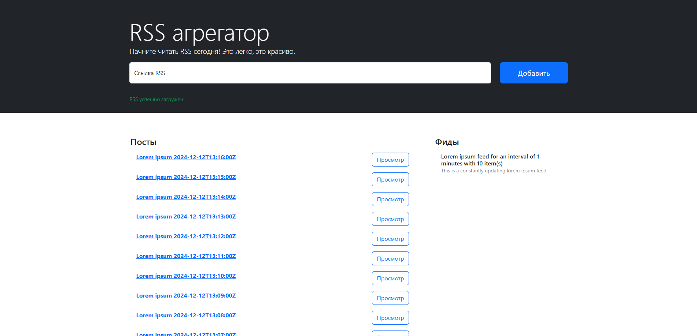

# RSS агрегатор

### Hexlet tests and linter status:
[](https://github.com/Pajzer/frontend-project-11/actions)

[](https://github.com/Pajzer/frontend-project-11/actions/workflows/nodejs.yml)

## Описание

[Rss Reader](https://frontend-project-11-jet-pi.vercel.app/) — сервис для агрегации RSS-потоков, с помощью которых удобно читать разнообразные источники, например, блоги. Он позволяет добавлять неограниченное количество RSS-лент, сам их обновляет и добавляет новые записи в общий поток.

## Установка 

### Клонировать проект
```
$ git clone 
```

### Установить зависимостей
```
$ make install
```

## Использование

### Запуск

```
$ make develop
```

### Сборка

```
$ make build
```

